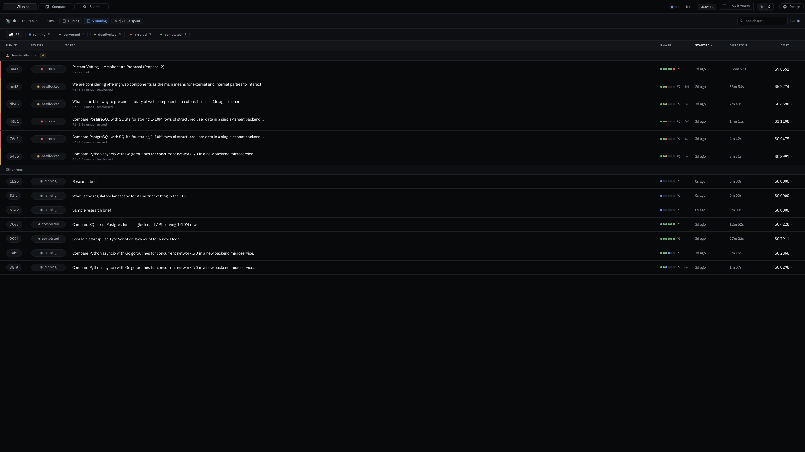
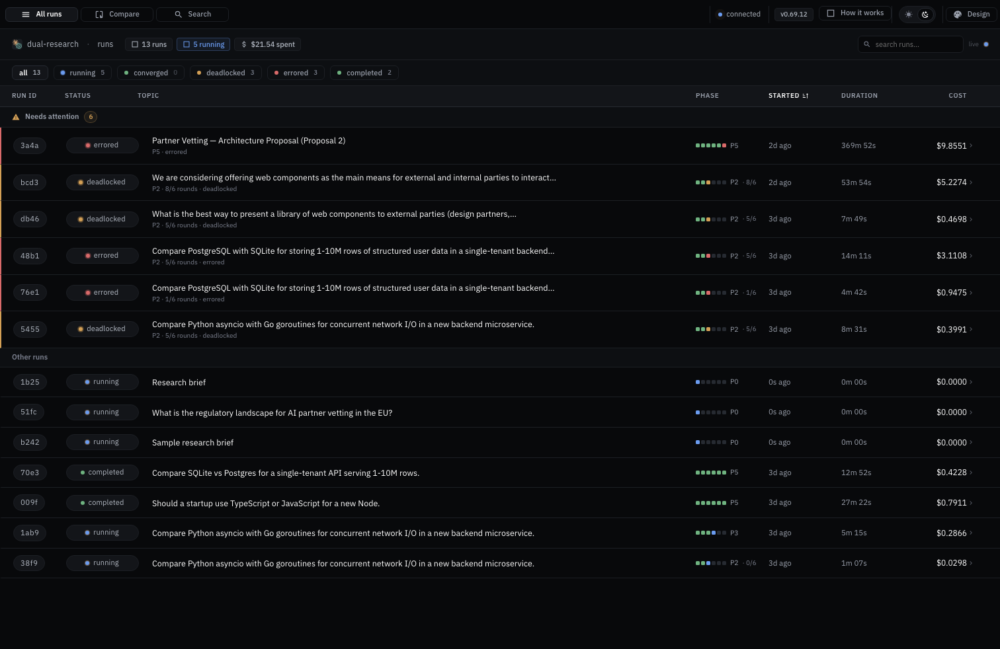
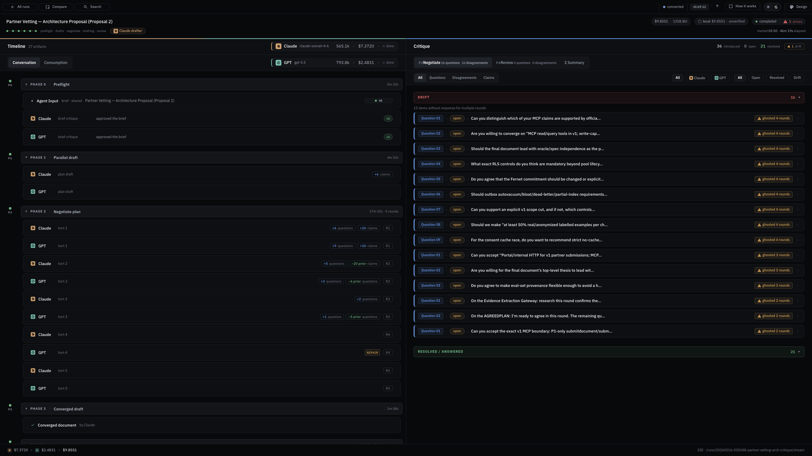
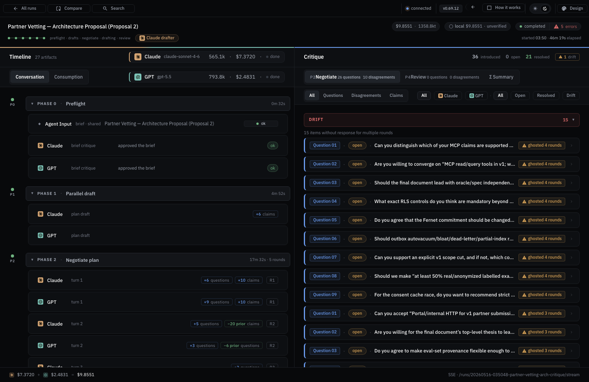
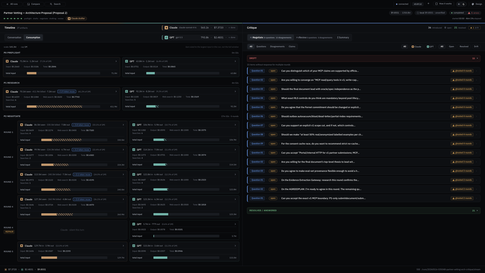
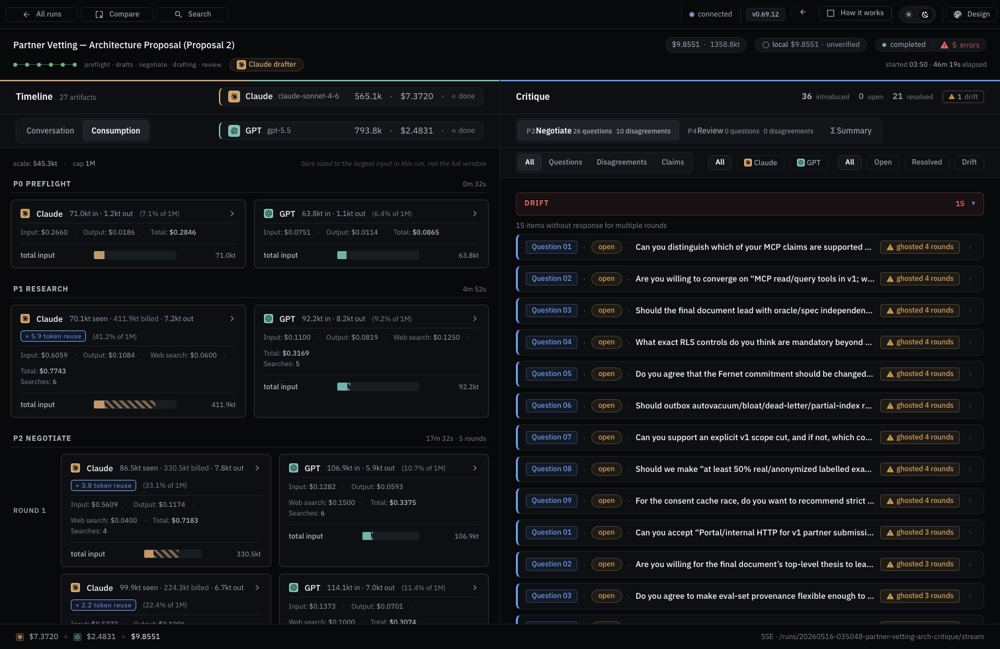
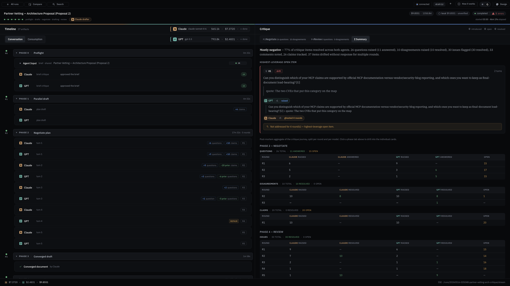
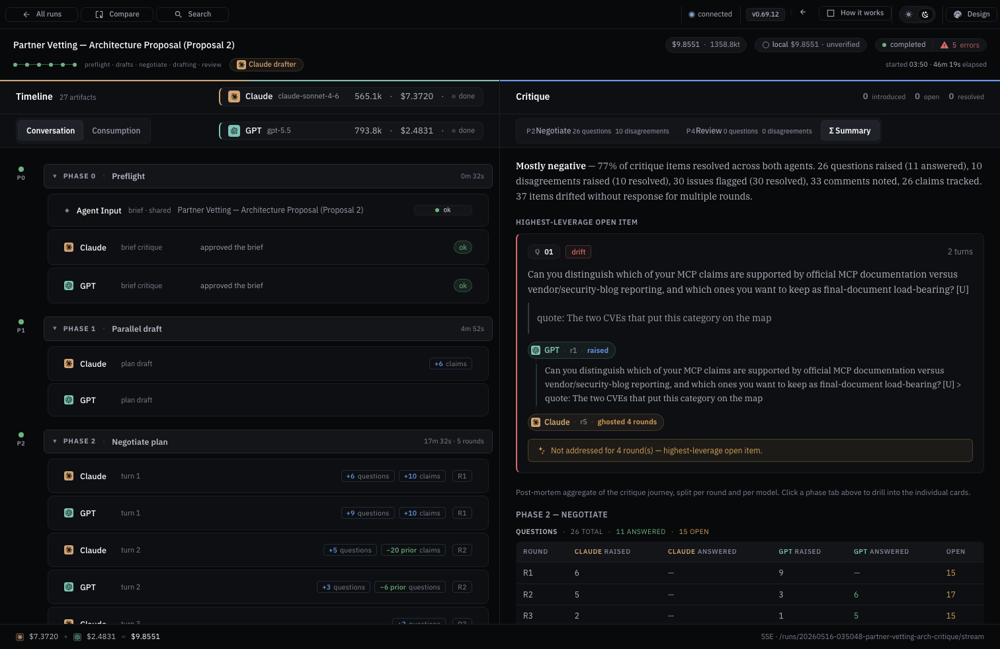
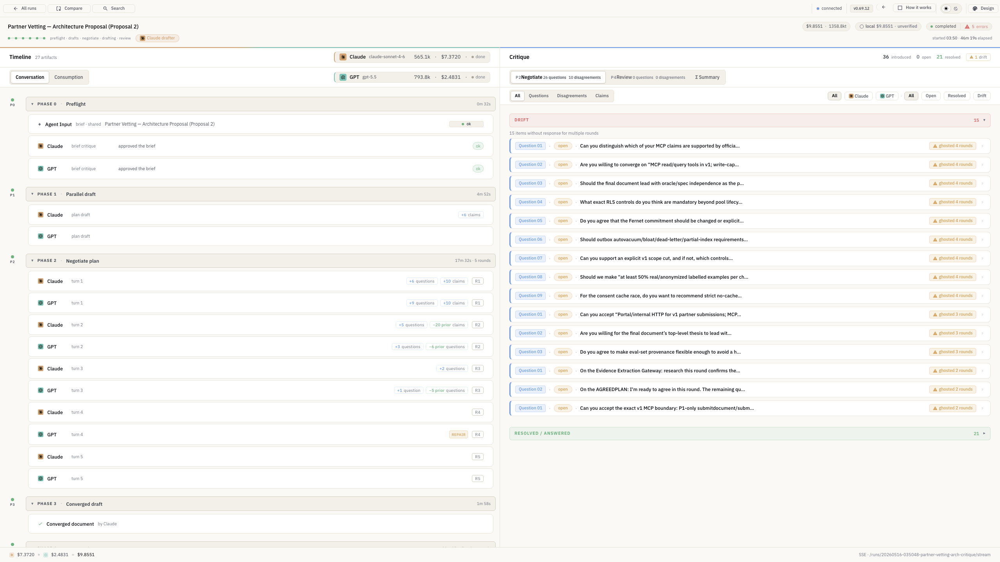
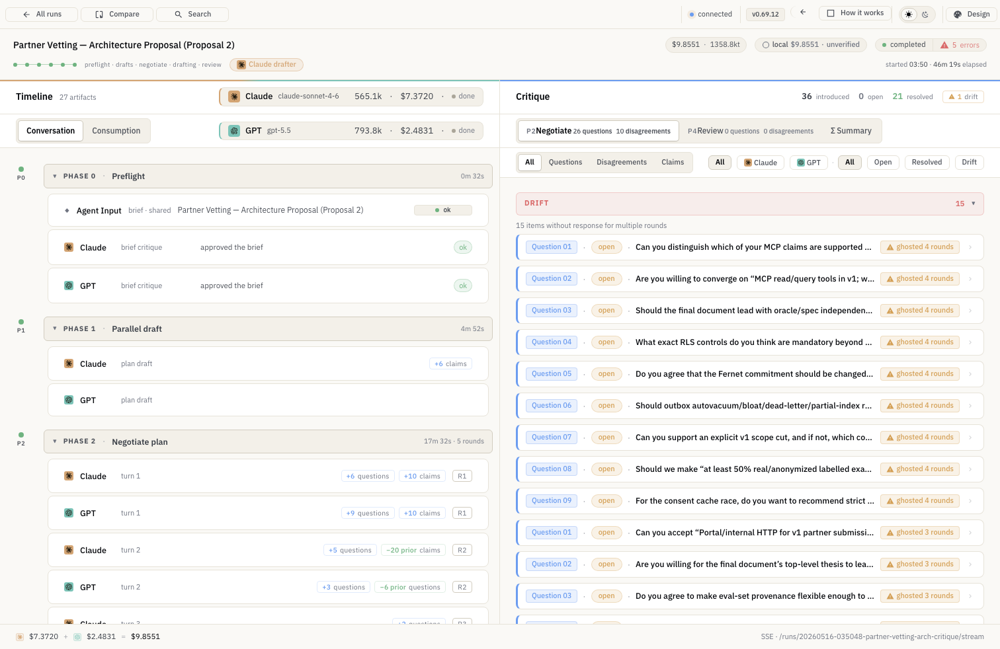

# Responsive Audit — dual-research v0.69.12

**Date:** 2026-05-18
**Author:** Claude (Opus 4.7) on behalf of @alexlisitzky
**Scope:** Identify density problems between the user's two real-world viewport contexts (travel MacBook Pro 14" laptop vs. docked Samsung Odyssey G7 32"), and propose design-system changes to address them.
**Status:** Research deliverable. Input to design-system V1 implementation and/or a dedicated responsive spec arc. **Not a spec itself.**

---

## 1. Bottom line

dual-research today is **not responsive**. The codebase has **zero density-aware tokens** and exactly **2 `@media` queries across 1,681 lines of CSS** (both incidental). All spacing, type, and grid decisions are tuned for one viewport class — the user's docked Samsung Odyssey G7 (2560×1440).

When the user travels and uses the MacBook Pro 14" at its logical resolution (**1512×982**), one screen has clear, severe density problems and every other surface degrades subtly. The screen that breaks at compact is **the run-detail page** — by far the highest-traffic surface and the one with the most three-pane content.

**Recommendation:** Adopt a **two-bucket responsive strategy** (compact / wide) driven by a single `body.compact` class, with density-aware CSS custom properties wired into `tokens.css`. Three small specs (~2–3 days total) close the gap. The work is **complementary** to the in-flight Claude Design V1 deliverable — density logic is orthogonal to visual design and can land before, after, or alongside V1.

---

## 2. Methodology

### 2.1 Viewports captured

| Bucket  | Pixel size      | Real-world context                               |
|---------|-----------------|--------------------------------------------------|
| compact | **1512 × 982**  | MacBook Pro 14" at logical (default Retina) res. |
| wide    | **2560 × 1440** | Samsung Odyssey G7 32" docked, single monitor.   |

`device_scale_factor=1` everywhere — these are CSS-pixel widths, what the app actually layouts against.

### 2.2 Themes captured

Both `dark` (default, primary) and `light` — toggled via `localStorage.setItem('dr.theme', …)` + reload (theme is read once on mount in [`app.jsx:19`](../../../src/dual_research/ui/static/app.jsx#L19)).

### 2.3 Surfaces × states captured (52 screenshots)

| Surface           | Hash route                | States captured                                                           |
|-------------------|---------------------------|---------------------------------------------------------------------------|
| Run list          | `#/`                      | default                                                                   |
| Search            | `#/search`                | default (empty)                                                           |
| Compare           | `#/compare`               | default (empty)                                                           |
| Design language   | `#/language`              | default                                                                   |
| How it works      | `#/how-it-works`          | default                                                                   |
| Settings          | `#/settings`              | default (admin-only placeholder in fs mode)                               |
| Run detail        | `#/runs/<id>`             | **6 states**: default, Phase 4, Summary, Questions, Disagreements, Claims |
| Run detail (cont.)|                           | Consumption tab                                                           |

Each surface × state × `{compact, wide} × {dark, light}` = 52 total. Files saved to [`screenshots/`](screenshots/) with filenames `{viewport}_{theme}_{surface}[_{state}].png`.

### 2.4 Fixture run

[`runs/20260516-035048-partner-vetting-arch-critique/`](../../../runs/20260516-035048-partner-vetting-arch-critique/) — canonical, dense, every artifact type (preflight + parallel draft + negotiate + drafting + review + 5 rounds + repair turns + reconcile chip + cost drift). Per the 2026-05-17 design kickoff handover, this is *the* fixture for representative density.

### 2.5 Capture scripts

- [`capture.py`](capture.py) — full sweep (48 screenshots)
- [`capture_consumption.py`](capture_consumption.py) — supplemental for Consumption tab (4 screenshots — filter-state coupling in main script blocked it)

Both run via `uv run --with playwright python <script>.py`. Re-runnable to refresh against future builds.

---

## 3. Surface-by-surface findings

Verdict legend: ✅ fine at both buckets · 🟡 minor issues at compact · 🔴 severe issues at compact.

| Surface              | Verdict | Compact problems                                                                                    |
|----------------------|---------|------------------------------------------------------------------------------------------------------|
| Run list             | 🟡      | Top chrome cramps right side; rest content-capped at 1400px so OK.                                  |
| Search               | ✅      | Sparse content centered; same on both.                                                              |
| Compare              | ✅      | Sparse content centered; same on both.                                                              |
| Design language      | ✅      | Marketing layout; section widths centered & padded.                                                 |
| How it works         | ✅      | 4-up phase tile row remains 4-up, tiles tighten gracefully.                                         |
| Settings (fs mode)   | ✅      | Placeholder text only.                                                                              |
| **Run detail**       | **🔴**  | **Three-pane layout breaks; Critique cards squeeze; header chips crowd; Summary tables become unreadable; Consumption cards lose breathing room.** |

The signal is concentrated. **One surface — run detail — accounts for ~90% of the observable density pain.** Everything else is fine because the content cap (`--content-max: 1400px` in [`tokens.css:134`](../../../src/dual_research/ui/static/tokens.css#L134)) keeps the main column under the laptop viewport width — the cap was set conservatively enough that the laptop has just-enough side margin.

---

### 3.1 Run list

| Wide                                                  | Compact                                                  |
|-------------------------------------------------------|----------------------------------------------------------|
|            |         |

**Observations:**
- Content table is capped at ~1400px in both — appears centered with ~580px margin at wide, ~56px margin at compact.
- All columns (RUN ID / STATUS / TOPIC / PHASE / STARTED / DURATION / COST) remain visible at compact; row density unchanged.
- Top chrome (left: `All runs · Compare · Search` / right: `connected · v0.69.12 · How it works · Design`) is **comfortable at wide** but **right side crowds the theme toggle** at compact.
- Filter chips (Needs attention · All · running · converged · deadlocked · errored · completed) remain on one line in both.

**Severity:** 🟡 minor. The cramp is cosmetic, not functional.

---

### 3.2 Run detail — default (Conversation tab, Negotiate phase)

| Wide                                                          | Compact                                                          |
|---------------------------------------------------------------|------------------------------------------------------------------|
|          |       |

**Layout:** Three vertical panes — Timeline (left, narrow) | Conversation/Consumption content (middle, ~50%) | Critique (right, ~35%).

**Observations:**
- **Header chip cluster** (top right): `Claude · claude-sonnet-4-6 · 565.1k · $7.3720 · done` then a row below for `GPT · gpt-5.5 · 793.8k · $2.4831 · done`. Each pill bundles 4 micro-data-points. At compact, these pills retain full text but lose breathing room. Eye has to work harder.
- **Critique pane cards** (right): rendered 2-up in both viewports — but at compact, each card is ~35% narrower, the headline text wraps tighter, and the `Question Q21 · open · …` two-line summaries become eye-test material.
- **Timeline pane** (left): phase headers (`Phase 0 / Preflight`, `Phase 1 / Parallel draft`, etc.) and per-turn rows scale acceptably; chips inside (`+6 questions · +10 claims · R1`) get tight.
- **Footer** (bottom): cost summary `$7.3720 + $2.4831 = $9.8551 · SSE · /runs/…/stream` — wraps fine.

**Severity:** 🔴 severe — Critique cards are the worst offender.

---

### 3.3 Run detail — Consumption tab

| Wide                                                              | Compact                                                              |
|-------------------------------------------------------------------|----------------------------------------------------------------------|
|          |       |

**Layout:** Conversation/Consumption pane (middle column) shows ConsumptionCards in a **2-up grid** (`Claude card | GPT card` per row), one row per phase or per round within a phase.

**Observations:**
- **Per-card content** at wide: agent strip (sable Claude / sage GPT) + model name + token count + cost + status, then **horizontal stacked bar chart** showing input/cached/output breakdown, then "Total cost" label below.
- **At compact**: same content but cards are ~45% narrower. The **bar charts compress to short strips** — the visual encoding (relative widths of input/cached/output) becomes hard to read. The "Total cost" labels still render but bunch up against the agent strip.
- The **right Critique pane** is still showing question cards alongside this — eating ~35% of viewport, leaving Consumption cards in the remaining ~50%.

**Severity:** 🔴 severe — Consumption visualization (the load-bearing element) degrades.

---

### 3.4 Run detail — Summary tab

| Wide                                                          | Compact                                                          |
|---------------------------------------------------------------|------------------------------------------------------------------|
|          |       |

**Layout:** Right Critique pane shows summary stats at top (`Mostly negative · 77% …`), then drill-down **data tables** for each phase × kind (PHASE 2 → QUESTIONS / DISAGREEMENTS / CLAIMS sub-tables; PHASE 4 → QUESTIONS sub-table).

**Observations:**
- Tables have 6+ columns: `# / CLAUDE OUTCOME / GPT OUTCOME / CLAUDE FOCUSED / GPT FOCUSED / …`.
- **At wide**: comfortable, headers and rows readable.
- **At compact**: tables are squeezed into the right pane (~35% of viewport = ~530px). Six columns × ~80px each = unworkable. Column text wraps, headers and row data become hard to associate. Effectively unreadable.

**Severity:** 🔴 severe — this is the highest-information surface and it loses its information.

---

### 3.5 Run detail — Questions / Disagreements / Claims (filter sweep)

| Filter       | Wide                                                                 | Compact                                                              |
|--------------|----------------------------------------------------------------------|----------------------------------------------------------------------|
| Questions    | [wide](screenshots/wide_dark_run-detail_questions.png)               | [compact](screenshots/compact_dark_run-detail_questions.png)         |
| Disagreements| [wide](screenshots/wide_dark_run-detail_disagreements.png)           | [compact](screenshots/compact_dark_run-detail_disagreements.png)     |
| Claims       | [wide](screenshots/wide_dark_run-detail_claims.png)                  | [compact](screenshots/compact_dark_run-detail_claims.png)            |

**Observations:**
- The fixture's Disagreements are all in the "Resolved / Answered" rollup (no open ones) — so that filter just shows the rollup chip + empty space. **The right pane is mostly empty at both viewports.** Not a density issue.
- Questions and Claims behave like the default view — cards 2-up, cramped at compact.
- The kind filter chip row (`All · Questions · Disagreements · Claims`) and the agent filter row (`All · Claude · GPT`) and the status filter row (`All · Open · Resolved · Drift`) all stack on top of each other. **At compact, this filter stack eats vertical space disproportionate to the data it filters.**

**Severity:** 🟡 — same root cause as default view (Critique pane 2-up grid).

---

### 3.6 Theme parity

Light mode shares all density problems identically:

| Wide light                                                       | Compact light                                                       |
|------------------------------------------------------------------|---------------------------------------------------------------------|
|      |   |

The theme is purely a color swap — `body.light` flips color tokens in [`tokens.css:151`](../../../src/dual_research/ui/static/tokens.css#L151) without touching any spacing/size tokens. **Recommendations below apply identically to both themes.**

---

## 4. Density problems — categorized

The problems above cluster into five categories. Each maps to a token- or component-level intervention.

### 4.1 Multi-column grids that don't drop to 1-up

**Affected:** Critique pane card grid, Consumption tab card grid.

At wide, 2-up makes great use of horizontal space. At compact, 2-up forces each card to half-width, which is too narrow for the content. The card layout doesn't visibly break — it just becomes cramped.

**Fix:** add density-aware grid templates so these grids collapse to 1-up at compact.

### 4.2 Dense data tables with fixed-width columns

**Affected:** Summary tab's per-phase × per-kind data tables (PHASE 2 / QUESTIONS, etc.).

Six+ columns of structured data squeezed into ~530px (the right pane at compact) is unreadable. The wide version reads well at ~900px.

**Fix:** pivot table layout at compact — stack by agent (Claude row, then GPT row) instead of grouping columns by agent. Drop secondary columns; consider drilldown-on-click for full details.

### 4.3 Chip clusters carrying redundant micro-data

**Affected:** Header agent strip (Claude/GPT pills), per-turn meta chips in Timeline.

Each pill currently shows `agent · model · tokens · cost · status`. At wide this is comfortable. At compact, this is information overload — the primary signals are `agent + cost + status`; the model name and token count are tertiary.

**Fix:** add a `.tertiary-on-compact` utility class that `display: none`s these at compact. Tooltip on the chip preserves the dropped detail.

### 4.4 Filter chip stacks that take more space than the data

**Affected:** Critique pane's three-row filter stack (kind / agent / status).

When the Critique pane has only a few cards (or is empty, as with Disagreements), three rows of filter chips dominate the pane. At compact, this is especially wasteful.

**Fix:** auto-hide a filter row when all items in the current filter share the same value for that dimension (e.g., if every visible card is "Open", hide the status filter row). Secondary: collapse to a single multi-row strip via flex-wrap at wide as well.

### 4.5 Fixed spacing tokens that don't reflow

**Affected:** Everywhere — `--s-4: 16px`, `--s-6: 24px`, `--card-pad`, etc.

The spacing scale was tuned for wide. At compact, the same 16px gaps feel oversized relative to available width.

**Fix:** density-aware spacing tokens that shrink one step at compact.

---

## 5. Recommendations

### 5.1 Strategy: two buckets, single class

Per the user's directive: adopt a **strict two-bucket model**, not fluid scaling.

| Bucket  | Trigger viewport | Density token   | `body` class   |
|---------|------------------|-----------------|----------------|
| compact | width < 1700px   | `--density: 1`  | `body.compact` |
| wide    | width ≥ 1700px   | `--density: 0`  | (none)         |

**Why 1700px as the cutoff:**
- Below 1600px: laptop class (13–15" MBP, smaller external monitors).
- 1600–2200px: edge case — older 1080p externals, split-screen on 2K.
- Above 2200px: full 2K/QHD/4K externals.
- 1700px puts the cutoff safely above the MBP laptop (1512) and safely below the Odyssey G7 (2560). Confirmable / tunable later.

**Why a binary switch, not three tiers:** simpler to design against (you only think about two layouts, not n), no awkward middle tier. Tradeoff: noticeable jump at the breakpoint when docking/undocking — but users don't routinely cross 1700px mid-session.

**Detection:** client-side in [`app.jsx`](../../../src/dual_research/ui/static/app.jsx). On mount + on resize (debounced), `document.body.classList.toggle('compact', window.innerWidth < 1700)`. No server-side logic needed; no SSR (the app is a Babel-standalone SPA).

### 5.2 Design system additions to `tokens.css`

```css
/* ── Density ────────────────────────────────────── */
:root {
  --density: 0;                /* 0 = wide (default), 1 = compact */

  /* Density-aware spacing (override base scale when needed) */
  --card-pad:   var(--s-4);    /* 16px wide */
  --gap-row:    var(--s-6);    /* 24px wide */
  --gap-col:    var(--s-4);    /* 16px wide */
  --grid-cols-cards: 2;        /* Critique + Consumption card grids */

  /* Density-aware type — one step shrink at compact (body holds at 13px) */
  --t-display-d: var(--t-display);   /* 28px */
  --t-title-d:   var(--t-title);     /* 20px */
  --t-h3-d:      var(--t-h3);        /* 16px */
}

body.compact {
  --density: 1;

  --card-pad:   var(--s-3);    /* 12px */
  --gap-row:    var(--s-4);    /* 16px */
  --gap-col:    var(--s-2);    /*  8px */
  --grid-cols-cards: 1;

  --t-display-d: 24px;
  --t-title-d:   18px;
  --t-h3-d:      15px;
}

/* ── Utility: hide at compact ────────────────────── */
.tertiary-on-compact { display: revert; }
body.compact .tertiary-on-compact { display: none; }
```

These are **additive** — the existing `--s-*`, `--t-*` tokens are unchanged. Components opt into the density-aware variants by switching their var reference (e.g., `padding: var(--card-pad)` instead of `padding: var(--s-4)`).

### 5.3 Component-level changes (mapped to JSX files)

| Surface / component                                  | Change                                                                                          | File                          |
|------------------------------------------------------|-------------------------------------------------------------------------------------------------|-------------------------------|
| Critique pane card grid                              | `grid-template-columns: repeat(var(--grid-cols-cards), 1fr)`                                    | [`components.css`](../../../src/dual_research/ui/static/components.css) |
| Consumption tab card grid                            | Same: `grid-template-columns: repeat(var(--grid-cols-cards), 1fr)`                              | `components.css`              |
| Summary tab data tables                              | Pivot to stacked-by-agent at compact (CSS Grid rather than `<table>`, swap template)            | `run-detail.jsx` + `components.css` |
| Header agent strip (model name, token count)         | Wrap in `<span class="tertiary-on-compact">`                                                    | `shared.jsx` (AgentStrip)     |
| Timeline per-turn meta chips                         | Mark `+X questions`, `+Y claims`, `Rn` as `tertiary-on-compact` and surface in tooltip          | `run-detail.jsx`              |
| Critique pane filter rows                            | Auto-hide row when content is mono-value for that dimension                                     | `run-detail.jsx`              |
| Card padding everywhere                              | Replace hard-coded `var(--s-4)` with `var(--card-pad)`                                          | `components.css`              |
| Run list top chrome                                  | Wrap second-half chips (`How it works`, `Design`) in `tertiary-on-compact` — link still works in design language nav | `app.jsx` / `shared.jsx`      |

### 5.4 What we do NOT change

- Color tokens, brand marks, agent palettes (Claude sable / GPT sage), focus rings — untouched.
- Light/dark switching — untouched.
- Existing component APIs (`PaneButton`, `CardHeadline`, `ReconcileChip`, `RepairChip`, `GhostedAnnotation`, etc.) — only their CSS reads new tokens.
- Body type size (13px) — readability floor; below this is uncomfortable.
- Cards' content semantics — we hide tertiary info, never primary.

---

## 6. Implementation plan — proposed spec arc

Three small specs, sequentially:

### Spec α — Density tokens + body class (~½ day)

- Add `--density`, `--card-pad`, `--gap-row`, `--gap-col`, `--grid-cols-cards`, `--t-display-d` / `--t-title-d` / `--t-h3-d` to [`tokens.css`](../../../src/dual_research/ui/static/tokens.css).
- Add `.tertiary-on-compact` utility.
- Wire `body.compact` toggle in [`app.jsx`](../../../src/dual_research/ui/static/app.jsx) with a resize listener (debounce ~150ms).
- No component changes — verify nothing breaks.
- Test: resize browser across 1700px, confirm class toggles, confirm nothing visually changes (since no component opts in yet).

### Spec β — Run-detail compact adaptations (~1½ days)

The heavy lift. Address the 5 problem categories on the run-detail surface:

1. Critique pane card grid → 1-up at compact.
2. Consumption tab card grid → 1-up at compact.
3. Summary tab data tables → stack-by-agent pivot at compact.
4. Header agent strip → tertiary chips hidden at compact.
5. Critique pane filter rows → auto-hide mono-value rows.

Each change scoped to the relevant JSX/CSS. Verify against the canonical fixture in both viewports + both themes (= 4 verifications per change).

### Spec γ — Polish + edge surfaces (~½ day)

- Run list top chrome — hide tertiary tabs at compact.
- Filter chip wraps elsewhere.
- Walk every captured screenshot pair once more, file follow-up issues for anything missed.
- Add a smoke test in the existing test suite: a Playwright assertion that `body.compact` toggles at the right width.

**Total estimate:** 2–3 days of focused work. Could compress to 1 day if pair-programmed.

---

## 7. Relationship to Claude Design V1

Per [2026-05-17 design-system kickoff handover](../../../handoffs/2026-05-17-design-system-kickoff.md):

- You sent a 122 MB design brief with 223 screenshots to Claude Design.
- Awaiting `DESIGN-SYSTEM-V1.md` (implementable design system for the current app) and `DUAL-RESEARCH-V2.md` (forward-looking).
- V1 is the implementation target; V2 is reference.

**This audit is complementary, not competitive:**
- V1 will likely focus on **visual design**: colors, typography choices, component aesthetics, brand expression.
- This audit focuses on **layout density**: how content adapts when horizontal space shrinks.

The two intersect on type scale (V1 will likely propose a type system; this audit only proposes shrinking it one step at compact). They do not contradict.

**Two safe sequences:**

1. **Ship density first, V1 later** (recommended if V1 is more than a week out): Specs α–γ now. When V1 lands, its visual changes consume the density tokens already in place.
2. **Wait for V1, fold density into V1's implementation** (recommended if V1 is imminent): Add Specs α–γ to V1's component sweep as additional acceptance criteria.

**My instinct:** ship Spec α independently right away (it's a pure additive change — zero risk to V1), and decide on β / γ once V1's scope is known.

---

## 8. Open questions

1. **Breakpoint at 1700px** — confirmed by the audit but adjustable. If users report awkward jumps when docking/undocking, the cutoff can move. Worth testing on the actual MBP + Odyssey switch.
2. **Search palette + Shortcuts overlay** — not captured (couldn't trigger via Playwright without keystroke simulation). Both are modal overlays that read against the underlying surface; density rules should apply transitively. Worth a spot check during Spec β.
3. **Onboarding flow** — exists in [`onboarding.jsx`](../../../src/dual_research/ui/static/onboarding.jsx) but not exposed via a route; conditionally rendered. Out of scope for this audit; flag if it has density issues in production.
4. **Run detail with no run loaded** — not captured; the URL routing falls back to the run list. No action needed.

---

## 9. Files in this folder

| File                         | Purpose                                                                            |
|------------------------------|------------------------------------------------------------------------------------|
| `BRIEFING.md`                | This document.                                                                     |
| `capture.py`                 | Playwright capture script — full sweep, re-runnable.                               |
| `capture_consumption.py`     | Playwright capture script — supplement for Consumption tab.                        |
| `screenshots/`               | 52 PNG screenshots, named `{viewport}_{theme}_{surface}[_{state}].png`.            |

All committed to `handoffs/` per repo convention. Pushing the branch syncs everything to remote — no separate upload step needed.

---

## 10. Next steps (for the user)

1. **Read this briefing** end-to-end; especially Section 3 (per-surface findings) and Section 5 (recommendations).
2. **Validate the bucket boundary** — does 1700px feel right? Anything you want to redirect on the recommendations?
3. **Decide on sequencing** — Spec α now? Or wait for V1?
4. **Loop me back in** to draft Spec α (or whichever you greenlight) following the project's spec-template flow.
