# Known issues — verbatim mirror from Notion

**Source:** [Notion · Known issues](https://www.notion.so/Known-issues-36499f3e507f80b0b5b6ccadbd0a900b)
**Captured:** 2026-05-19 by Claude Code via the Notion connector.
**Why mirrored here:** Notion's S3 image URLs are short-lived signed URLs (1-hour expiry). This folder is the stable in-repo source of truth used to validate spec implementations later. Each screenshot below is the locally-committed binary; the original signed URL is recorded under `> source:` for traceability.

Issue text is verbatim — no paraphrasing, no cleanup. Product owner's wording is the spec.

---

## Issue 1 — Model badges (Claude / GPT) inconsistent heights

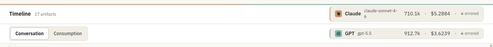

As you can see on the screenshot, the height of the GPT badge and the height of the Claude badge on the right-hand side are not the same. It is probably because the Claude Sonnet 4-6 name pushes the content upwards. Also the GPT badge itself is a little bit too tight from a vertical space point of view.

I would need to increase the height of the GPT 5 badge slightly. I would need you to make sure that the Claude badge is the exact same height and that they are both horizontally just a little bit longer so that the entirety of the Claude Sonnet 4-6 name would fit in there. I need you to take a screenshot afterwards to validate that it happened.

> source: prod-files-secure.s3 · `c19304ab-6eee-4b11-af3f-abea49d09cfa/image.png`

---

## Issue 2 — Critique section structure is wrong (use the design-system layout)

As you can see in the screenshot below, this is how we currently implemented the critique section.

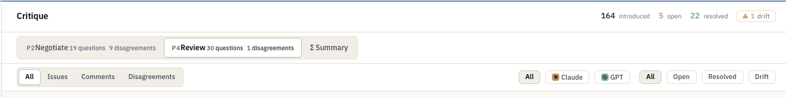

And this is how you should have implemented it so please make sure that that's the design once you have fixed the issues.

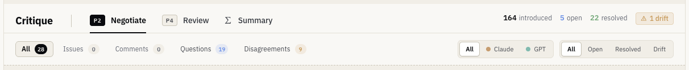

> source: prod-files-secure.s3 · `381b9249-44f8-4879-afd4-c7c91cf0a9cb/image.png` (current)
> source: prod-files-secure.s3 · `f1214804-0802-49a5-9cca-fa1600ad99ef/image.png` (target)

---

## Issue 3 — Phase headers bigger than card headers + hover elevation on cards

Issue number 3: it's the size of the face headers versus the cards inside. What I would like to do is I want to make sure that the face header is bigger than the card header.

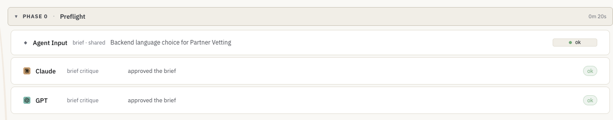

Please look at the screenshot below. That's a screenshot from the critique section. I want to make sure that the cards in the timeline section are the same size as the cards in the critique section. I want to make sure that the face headers for Phase 1, Phase 2, and Phase, and also the face headers in the critique section (drift, open, resolved, answered) will be slightly bigger than they are now so that they're just a little bit higher than the card inside it. Also in our design system we have elevation options. I would like to make sure that when you hover over a card (not a header) in both the timeline and the critique sections, the card will get an elevation on hover.

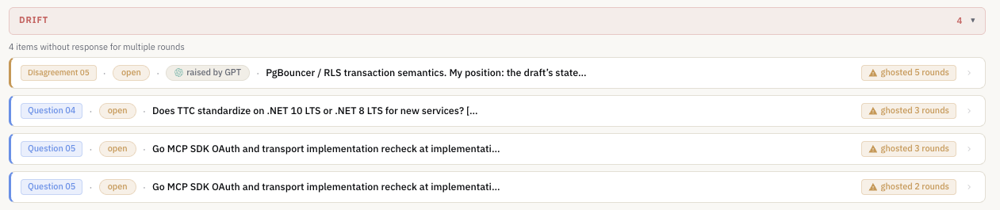

> source: prod-files-secure.s3 · `859f8bd9-4480-44c5-ba57-9aa59f66010d/image.png`
> source: prod-files-secure.s3 · `7b8bef8c-bc8a-4f0e-a4b9-1cc2202ea9ec/image.png`

---

## Issue 4 — All "OK" badges must use one consistent style

If you look at the current screenshot on the right-hand side, we are showing batches with OKs. All our OK batches should look the same. We should pick one style and we should show that style. I need you to. The style I would like to pick is the lower two OKs. The first OK should not look like this. All the OKs should look like the green two OKs.

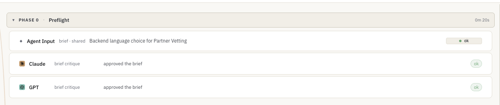

> source: prod-files-secure.s3 · `a28a08d5-3bdc-4c14-9e7e-c58af25970d1/image.png`

---

## Issue 5 — Phase indicators on the timeline jump around / aren't anchored

The timeline component is still broken. The indicators on the left of the headers, the green dot with P0, P1, P2, are not correctly anchored to the headers themselves as you can see on the various screenshots. They jump all over the place and do not have an understanding of how many headers there are currently displayed. As you can see in some of the screenshots, we only have three headers for phase one, for phase 0, 1, and 2, but somehow all the indicators are overlapping and showing phase 4 and other phases that we haven't even started yet.

Most importantly none of them are anchored. If you can see on the screenshots, sometimes the face is open and sometimes this face is closed and all these dots are jumping all over the place. You need to make sure that you validate that, through several screenshots, once this feature is finished. When you open and unfold and have different types of scenarios where you have one, two, or five different headers and these headers are collapsed or open, the anchored indicators on the left should always be in the right spot.

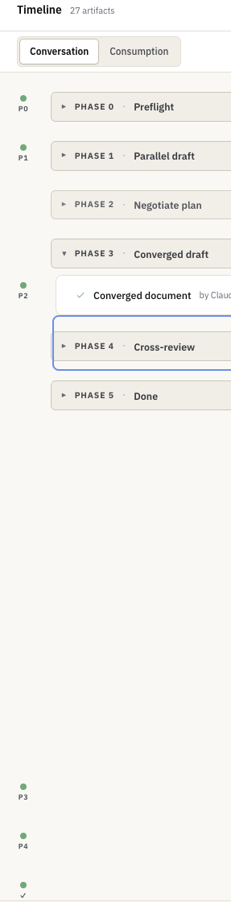
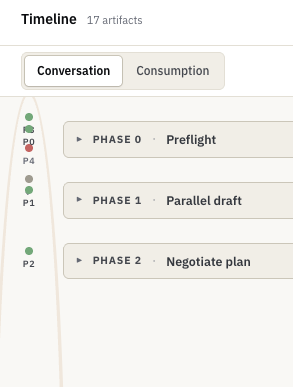
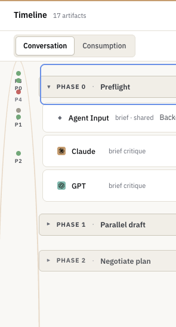

> source: prod-files-secure.s3 · `3f8d83d0-1846-4c27-b98b-2854b0d7c043/image.png`
> source: prod-files-secure.s3 · `9e3a106a-c60c-4d2b-a25a-cb3f3507284e/Screenshot_2026-05-18_at_20.18.02.png`
> source: prod-files-secure.s3 · `40df624a-4fa0-4a96-a620-60fcea793978/Screenshot_2026-05-18_at_20.18.07.png`

---

## Issue 6 — Three headers in the run-detail strip should be reduced to two

See screenshot below. We have three headers:
1. The header with the buttons all runs, compare, and search.
2. The header with dual search runs and spent.
3. The header with the filter buttons.

I want this to be reduced from three headers to two headers. How do we do that?

- You completely remove the icon and the text dual search.
- You remove the empty word runs.
- You move the buttons three runs and cost all the way to the right, aligned with the search.
- You take the filter buttons below and put them in that spot where we just removed everything. Left aligned in the second header.

That frees up the entire third header and we can completely remove that.

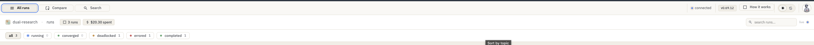

> source: prod-files-secure.s3 · `67cb785e-581a-472a-a6dc-f48496a17326/image.png`

---

## Issue 7 — Question card duplicates the question at the top

See the screenshot. We are in the questions card, repeating the question without any value. If you look at the top we start first with the question on D6 specification, review, OpenAI, and so forth. Then we have a quote and then we say Claude round one raised and we repeat the exact same question as we start with at the top.

Let's not do that. I want to remove that first question at the top. Start directly with the provider who raised the question badge as the first chip and put the quote inside the relevant provider who actually had the quote.

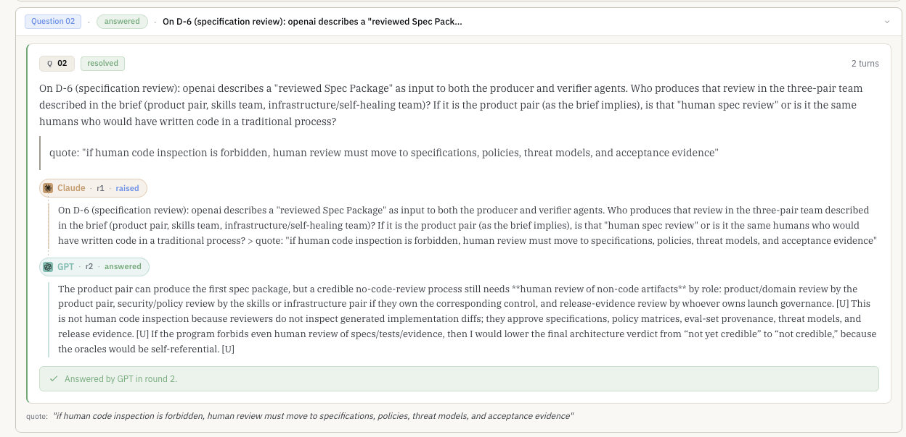

> source: prod-files-secure.s3 · `93fa3aca-a23a-4a00-9a34-0735050b508a/image.png`

---

## Issue 8 — Disagreement card has the same duplication problem

The exact same thing can be said about disagreements. Also there we start with a resolved batch and just at the top we already have a resolved batch so that's not needed. Let's start with the very first thing: the model who started it and then we chronologically follow the trail.

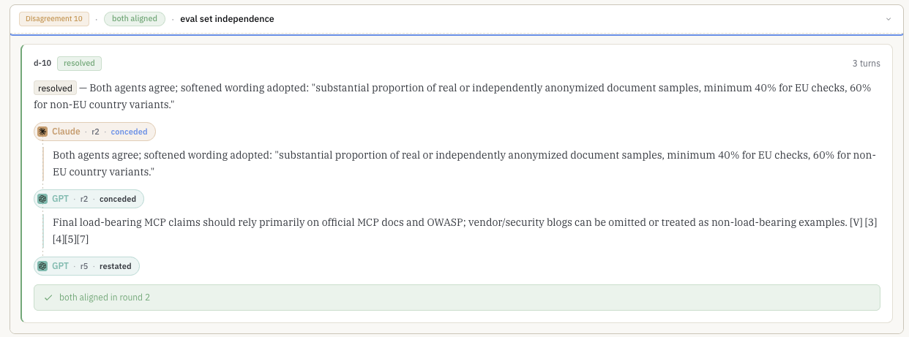

> source: prod-files-secure.s3 · `43525ef1-b935-417e-b80c-774677938b14/image.png`

---

## Issue 9 — Issue card (review phase) has too much info, illogical sequence, duplicated quote

I'm looking here at an issue card from the review phase and there's too much information there and some of it doesn't even align.

At the top we start with issue 0.1, Claude, a batch for issue 0.1, a batch for Claude, followed by a batch that says "resolved". If we look below it we start with C1. I don't even know what C1 means. We have an anti-pattern that we cannot have these random letters and digits. If we want to say something, it should be clearly indicated with the batch and the batch should spell out the full name. Maybe that batch is not even needed there.

We follow up with a status that says "open" while the issue says "resolved". I'm not sure: is it open, is it resolved? This is followed by, I guess, a title, but then followed by a quote and only then by some paragraph. This is then followed by "flagged by Claude", "first seen in round 1", "last seen in round 2", and then followed again by something random, which is the exact same quote. Followed again by the exact same quote. All of it just doesn't make sense.

We need to clearly start by indicating who raised the issue and in what round. We can mention in what second round it was raised. We then mention the issue and we then have a quote below it so that is sequentially it makes sense to consume the information. In the header of the card we put the correct batches as well that would align but not overlap with the same info, that would provide information, but not overlap with information when you unfold the card.

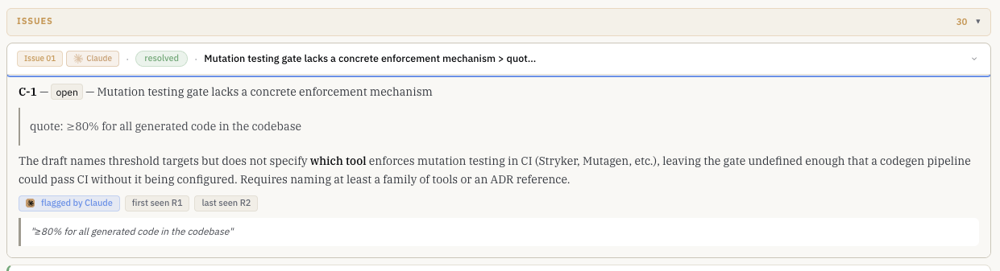

> source: prod-files-secure.s3 · `f26bae56-8085-43e3-b327-112d92a749c0/image.png`

---

## Issue 10 — Comments on the review tab have the same anti-patterns as issue 9

The exact same thing as issue number nine can also be said about the comments on the review tab. Those cards also have an illogical sequence of presenting information. Quotes are duplicated and the badges are just not correct. Please make sure that you follow the same logic as you apply for number nine so that all of them show information that is relevant when it is closed, when it is open, and in the right sequence, and that there is no duplicate information present.

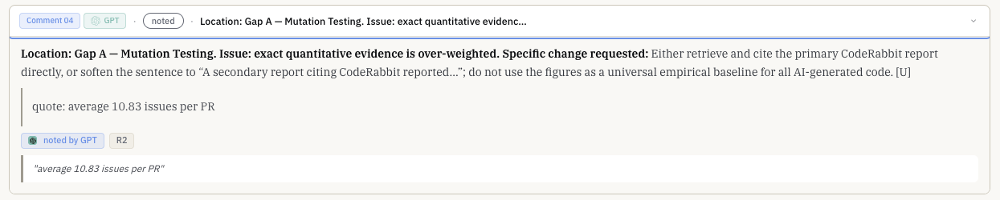

> source: prod-files-secure.s3 · `9d752c6f-df1e-4501-97b2-341cae5ccd13/image.png`

---

## Issue 11 — Double divider line when unfolding the first card under Phase 4

See if the attached screenshots when I unfold the first card under phase four, then it gets two divider lines instead of just showing one divider line. It looks awkward.

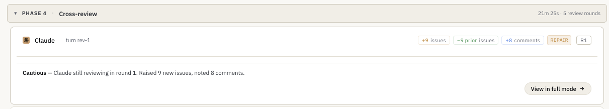

> source: prod-files-secure.s3 · `efd92287-f9c3-461f-89c1-5637b0c31601/image.png`

> *(Note: the Notion page reads "Picture number eleven" — preserved verbatim above with the conventional "Issue 11" heading for cross-referenceability.)*

---

## Issue 12 — Collapsed consumption card data points must change

I would like to change the data points and visualisation and what we record on these cards. Let's go over it.

When the card is collapsed right now we're showing three headers:
1. The first header with the cloud icon and cloud name
2. The second header with the cost
3. The third header with the bar

That's what we have now.

I would like to change the data points on the collapsed versions of our data consumption screens. What we would have to have is the following:
1. The first header should have the provider icon, the provider name, the total amount of tokens, and the total cost, and then the percentage in brackets of these total tokens compared to their available context.
2. On the second header, where we right now show input cost, output cost, and total cost, these data points should not be shown when the card is in a collapsed state. Instead we should show the total input bar.
3. As the third header, where we now have the total input bar, which now moves up on the third row, we show the total output bar. It's a new data point which we currently do not have.

I repeat the new state would be:
1. First header: I can provide a name, total tokens, total cost, and percentage of total tokens against the context. These three data points should start aligning at the same level where the bar starts.
2. On the second header we show the total input bar.
3. On the third header we show the total output bar (output bar), and both bars can indicate the actual amount of tokens at the end of the bar, just like you do now.

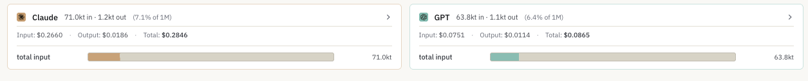

> source: prod-files-secure.s3 · `6f84febb-68b3-4f10-a31c-4434b672cd01/image.png`

---

## Issue 13 — Unfolded consumption card data points must change

Here I would like to change the data points of the unfolded version of the cards but we need to take into consideration the changes that we did for issue number 12.

Once issue number 12 is implemented what I want to happen is that when you unfold the card, the first thing that we start with is total input tokens. We show the total bar then below it we show an entry for every single input that we record separately. We also show the bar for that.

Once we've exhausted all the visualisations of the inputs, we show a separation line and below that we show in text:
- the total input tokens as a number
- the total input tokens as a cost
- the web search as a cost if we did web search
- the total cost for the input

Then we show that total output bar and we follow the same logic. We show every individual entry that represents the output as a name plus bar. Once we have exhausted all of them, we show a new separation line and below that we show the same data points as above:
- total output tokens
- total output cost
- any web searches that we did
- the total cost there where you show that we had so much token reuse batches

If there is a way how you could also visualise in this individual entries where reuse happened, that would be nice. I guess that's what you already do with the striped visualisation.

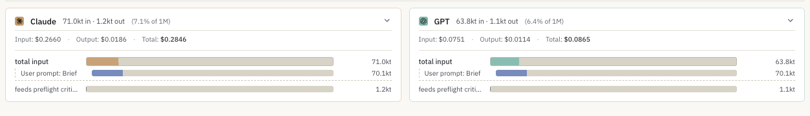

> source: prod-files-secure.s3 · `76d6e153-2693-43f0-a05b-17cb4e3dd87a/image.png`

---

## Issue 14 — Consumption cards change horizontal size between phases

As you can see on the screenshot, the cards where we visualise the consumption change all of a sudden change format when we go into the rounds of negotiation and later also in the rounds of review, and that causes complete chaos on screen. We need to make sure that the cards always stay the same size and the size is the exact size as you start in Phase 0 and Phase 1, and it should continue with the same size. We should find a way how we visualise round 1 differently. Perhaps we can put it at the top of each card so that all cards always have the exact same horizontal size.

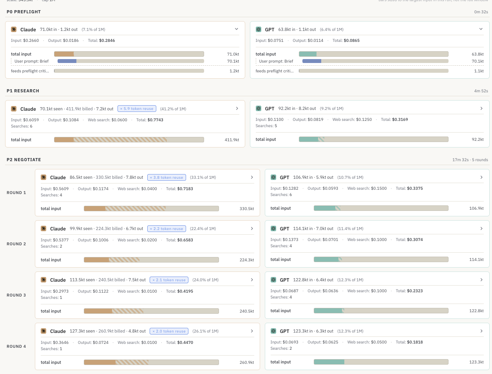

> source: prod-files-secure.s3 · `8f5f137b-cca5-4e1d-80e7-2cd39e8c0c5e/image.png`

---

## Issue 15 — Consumption legend should be a sticky bottom bar

Also on the consumption tab below we have a legend but because we always have a lot of cards, that legend is all the way below and you have no visibility on all of this. Can you make it such that this becomes a sticky lower bottom bar and that when you scroll the content scrolls below it so that the legend always stays on screen?

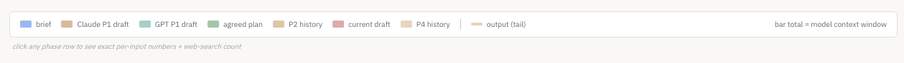

> source: prod-files-secure.s3 · `bffe6da9-161e-4071-a2ce-a818efc91fb9/image.png`

---

## Issue 16 — REPAIR-round explainer card

When we have a round where we have a repair, can you please put the repair tag inside the card that says "GPT silent this turn"? Can you also actually explain what that means in a small sentence below it, like what happened and what's going to happen next, so that it's clear to the user what they're looking at?

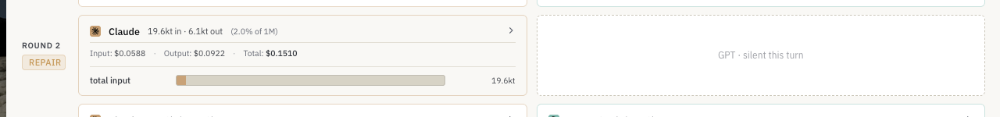

> source: prod-files-secure.s3 · `a8bb5c36-3161-4ccc-bd7f-657009e89ebf/image.png`

---

## Issue 17 — Top-bar layout when viewing an individual run

As you can see on the screenshot, this is a view of the top bar when I'm viewing an individual run.
1. First of all for some reason we put the back button in between the version and the "How it works" button. That's not needed. Please remove the back button. We don't need it there.
2. Once we remove that we need to make sure that there is a separation line between the version tag and the "How it works" button.
3. We also need to make sure that they're both aligned the same way so that the version and "How it works" are equally aligned vertically so that they don't look like it's jumping.

> source: prod-files-secure.s3 · `9d652d3b-c601-49f4-ac48-9c1e5cd63019/image.png`

---

## Discrepancies vs `_archive/seeding/V2-BRIEFING.md` §5

None. The Notion source and the verbatim block in the briefing agree word-for-word. The only header difference is that Notion calls issue 11 "Picture number eleven" while the briefing calls it "Issue 11"; semantically identical.

> Path note: this section originally referenced `docs/design-system-v2/README.md`. That file was renamed to `V2-BRIEFING.md` and moved to `design-system/_archive/seeding/` in spec 0127 (2026-05-20). The content didn't change.
